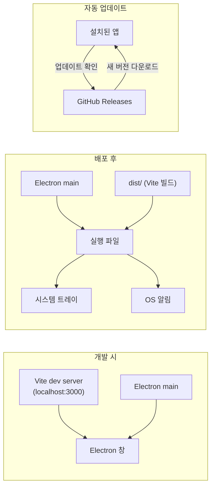

# Electron 데스크톱 앱 전환 계획

## 현재 구조 요약

- [vite.config.ts](c:\Users\SHC\Desktop\jindan system\vite.config.ts): `base: '/jindan-system/'` (GitHub Pages용)
- [package.json](c:\Users\SHC\Desktop\jindan system\package.json): Vite 빌드, Firebase 등 의존성
- 알림: [useNotifications](c:\Users\SHC\Desktop\jindan system\src\hooks\useNotifications.ts) → Firestore 구독, [NotificationContext](c:\Users\SHC\Desktop\jindan system\src\contexts\NotificationContext.tsx)에서 `onNew` 시 `addToast`만 호출 (앱 내 토스트)
- 배포: [.github/workflows/deploy.yml](c:\Users\SHC\Desktop\jindan systemgithub\workflows\deploy.yml)로 master push 시 GitHub Pages 배포

---

## 1. 사용자가 준비·설정할 것 (순서)

### 1-1. GitHub 저장소 설정

- **공개(Public) 저장소**: electron-updater는 기본적으로 GitHub Releases를 조회합니다. 공개 저장소면 별도 토큰 없이 앱에서 최신 버전 체크 가능.
- **비공개(Private) 저장소**를 쓸 경우: 앱이 Releases 목록을 읽으려면 GitHub Personal Access Token(PAT)이 필요합니다. 나중에 앱 패키징 시 `GH_TOKEN` 환경 변수나 설정으로 넣어야 하며, 사용자별로 토큰을 심는 것은 비현실적이므로 **자동 업데이트는 공개 저장소 또는 별도 공개 업데이트 서버**를 쓰는 편이 좋습니다.
- **Actions 권한**: 기존처럼 Settings → Actions → General에서 workflow가 저장소 내용/Releases에 쓸 수 있도록 허용. (기본값으로 보통 가능)

### 1-2. GitHub Secrets (이미 있다면 생략)

- 현재 웹 빌드에 쓰는 것: `GEMINI_API_KEY`, `VITE_FIREBASE_*` 6종. Electron 빌드에서도 **웹 리소스 빌드**를 하므로 동일한 시크릿이 필요합니다.
- **추가로 필요한 시크릿**: 없음. Release 업로드는 기본 제공되는 `GITHUB_TOKEN`으로 가능합니다. (같은 저장소에 Release 생성·에셋 업로드)

### 1-3. 버전·앱 식별자 결정

- **package.json `version`**: 자동 업데이트는 시맨틱 버전(e.g. `1.0.0`)을 기준으로 비교합니다. 앞으로 배포 시맨틱 버전을 올릴 예정이라면 지금부터 `"version": "1.0.0"` 형태로 관리하는 것이 좋습니다.
- **앱 ID(선택)**: Windows에서는 `electron-builder`의 `appId` (예: `com.kdvo.jindan-system`). 나중에 설치 경로·프로토콜 연결 등에 쓰입니다.

### 1-4. 로컬에 준비할 파일(구현 시 생성될 것)

- 아래 "구현 작업"에서 생성할 파일 목록만 미리 정리합니다. **직접 준비할 "빈 파일"은 없고**, 구현 단계에서 코드로 추가하면 됩니다.
  - `electron/main.ts` (또는 `electron/main.js`)
  - `electron/preload.ts` (또는 `preload.js`)
  - `electron/tsconfig.json` (main/preload를 TypeScript로 쓸 경우)
  - `package.json`에 스크립트·electron·electron-builder·electron-updater 의존성 추가
  - `electron-builder` 설정 (package.json `build` 필드 또는 `electron-builder.yml`)
  - Vite base 분기 (Electron 빌드 시 `base: './'`)용 환경 변수 또는 별도 설정

---

## 2. 아키텍처 요약

- **개발**: Vite는 그대로 `npm run dev`로 띄우고, Electron 메인 프로세스만 "창을 열고 `http://localhost:3000` 로드". 기존처럼 HMR로 화면 수정 가능.
- **배포**: Vite 빌드 시 Electron용으로는 `base: './'` 사용 → `dist/`를 Electron에서 `file://`로 로드 → 이 결과물을 electron-builder로 패키징해 실행 파일 생성.
- **알림**: 앱 내 토스트는 유지하고, Electron 환경일 때만 메인 프로세스에 "OS 알림 띄우기" 요청을 보내서 Windows 알림(토스트)을 추가.

---

## 3. 구현 작업 (할 일 순서)

### 3-1. Electron 의존성 및 스크립트

- **설치**: `electron`, `electron-builder`, `electron-updater` (devDependencies), 개발 시 동시 실행용 `concurrently` (devDependency).
- **package.json 스크립트 예시**:
  - `dev:electron`: Vite dev 서버 + Electron 실행 (Electron은 `http://localhost:3000` 로드). 기존 `npm run dev`는 웹 전용으로 유지.
  - `build:web`: 기존처럼 GitHub Pages용 빌드 (`base` 유지). 기존 `build`를 이렇게 두거나 이름만 정리.
  - `build:electron`: Electron용 Vite 빌드 (`base: './'`) 후 `electron-builder`로 패키징 (Windows exe 등).
- **Electron용 base 분기**: `vite.config.ts`에서 `process.env.ELECTRON` 또는 `mode === 'electron'` 등으로 분기해, Electron 빌드일 때만 `base: './'` 적용. 스크립트에서 `ELECTRON=true npm run build` 형태로 호출.

### 3-2. Electron 메인 프로세스 (electron/main.ts)

- **창 생성**: `BrowserWindow`에서
  - 개발 시: `loadURL('http://localhost:3000')`
  - 프로덕션: `loadFile('dist/index.html')` (Vite 빌드 결과 기준 경로)
- **트레이**: `Tray` 아이콘 생성, 창 `close` 시 `window.hide()`만 하고 앱은 유지. 트레이 아이콘 클릭 시 `window.show()`. "종료"는 트레이 메뉴에 "종료" 항목으로만 제공.
- **preload 연결**: `webPreferences.preload`에 `path.join(__dirname, 'preload.js')` (또는 빌드된 preload 경로) 지정. `contextIsolation: true`, `nodeIntegration: false` 유지.

### 3-3. Preload 스크립트 (electron/preload.ts)

- `contextBridge.exposeInMainWorld('electronAPI', { ... })` 로 렌더러에 노출할 API만 정의:
  - `showNotification(title: string, body: string)` → `ipcRenderer.invoke('notification:show', title, body)`
  - (선택) `getVersion()` → 앱 버전 표시/업데이트 문구용
- 메인 프로세스에서 `ipcMain.handle('notification:show', ...)` 구현 시 `new Notification({ title, body })` 호출. Windows에서 권한은 사용자가 앱을 한 번 실행하면 보통 허용됨.

### 3-4. 렌더러에서 OS 알림 호출

- 기존 알림 흐름 유지: [NotificationContext](c:\Users\SHC\Desktop\jindan system\src\contexts\NotificationContext.tsx)의 `onNew`에서 `addToast` 호출은 그대로 둠.
- **추가**: `onNew` 콜백 안에서 `window.electronAPI?.showNotification(title, message)` 를 호출하도록 한 곳에서만 분기 (예: `NotificationContext` 또는 `useNotifications` 쪽). `electronAPI`가 없으면 웹이므로 무시. 타입은 `src/global.d.ts` 등에 `interface Window { electronAPI?: { showNotification: (title: string, body: string) => void } }` 선언.

### 3-5. electron-builder 설정

- **package.json `"build"`** (또는 electron-builder.yml):
  - `appId`: 예) `com.kdvo.jindan-system`
  - `productName`: 사용자에게 보일 이름 (예: KDVO 안전진단팀)
  - `files`: `["dist/**", "electron/**"]` 등 (Vite 출력 + Electron main/preload)
  - `extraResources` 또는 `extraMetadata`: main 진입점 지정 (예: `"main": "electron/main.js"` 또는 빌드 출력 경로)
  - Windows: `target: ["nsis"]` 또는 `["portable"]` 등 (NSIS 설치형 권장)
  - `publish`: `provider: "github"`, `repo`: `SHC-Developer/jindan-system`, `owner`: `SHC-Developer`. 공개 저장소면 `vcsAuthToken` 없이도 electron-updater가 최신 Release를 조회 가능.
- **엔트리**: Electron 실행 시 `package.json`의 `main` 필드가 `electron/main.js`(또는 컴파일된 경로)를 가리키도록 설정. TypeScript 사용 시 빌드 스텝에서 `tsc -p electron/tsconfig.json` 등으로 컴파일 후 `main.js`를 가리키게 함.

### 3-6. 자동 업데이트 (electron-updater)

- **메인 프로세스**: `autoUpdater` import 후, `app.on('ready')` 이후에 `autoUpdater.checkForUpdatesAndNotify()` 호출 (주기적 체크는 `setInterval` 또는 `autoUpdater` 옵션으로 가능).
- **업데이트 서버**: `publish`에 `provider: 'github'`만 맞추면, GitHub Releases의 태그(e.g. `v1.0.0`)와 해당 Release에 업로드된 `.exe`/설치 파일을 electron-updater가 자동 인식.
- **버전**: `package.json`의 `version`과 GitHub Release 태그(`v1.0.0`)를 일치시키는 것이 좋습니다. CI에서 버전을 `package.json`에서 읽어 태그를 만들거나, 태그에서 버전을 읽어 빌드하도록 하면 됨.

### 3-7. GitHub Actions 워크플로 (Release 빌드)

- **트리거**: `push: tags: - 'v*'` (예: `v1.0.0` 태그 푸시 시).
- **작업**:
  1. checkout, Node 설정, `npm ci`
  2. (선택) Firebase 등 시크릿을 env에 넣고 **Electron용 웹 빌드** 1회 실행 (`ELECTRON=true npm run build` 또는 이에 맞는 스크립트).
  3. Electron 메인/ preload 빌드 (TS인 경우 `tsc -p electron`).
  4. `electron-builder` 실행 (Windows용은 한 워크플로에서 `runs-on: windows-latest`로 빌드하는 것이 안정적).
  5. **GitHub Release 생성**: 해당 태그로 Release 생성 후, 빌드된 exe/설치 파일을 Release 에셋으로 업로드. `actions/upload-release-asset` 또는 `softprops/action-gh-release` 사용. `GITHUB_TOKEN`에 `contents: write` 권한 부여.
- **기존 deploy.yml**: GitHub Pages 배포는 그대로 두면 됨. master push → 웹 배포, 태그 push → Electron Release 빌드·업로드로 역할 분리.

---

## 4. 사용자(개발자) 작업 흐름 정리

| 목적                 | 명령                                                           | 비고                                                |
| ------------------ | ------------------------------------------------------------ | ------------------------------------------------- |
| 웹만 로컬 확인           | `npm run dev`                                                | 기존과 동일, 브라우저에서 확인                                 |
| Electron 창에서 로컬 확인 | `npm run dev:electron`                                       | Vite + Electron 동시 실행, 창에 localhost 로드            |
| 웹(Pages) 배포용 빌드    | `npm run build` (또는 build:web)                               | base `/jindan-system/` 유지                         |
| 데스크톱 설치 파일 생성      | `npm run build:electron`                                     | 로컬에서 exe 등 생성                                     |
| 사용자에게 새 버전 배포      | 저장소에 태그 푸시 (e.g. `git tag v1.0.0 && git push origin v1.0.0`) | Actions가 빌드 후 GitHub Release에 업로드, 앱이 자동 업데이트로 감지 |

---

## 5. 사용자가 할 GitHub/로컬 준비 체크리스트 (순서)

1. **저장소 공개 여부 결정**: 공개 권장 (자동 업데이트가 별도 토큰 없이 동작).
2. **package.json `version`**: 시맨틱 버전으로 설정 (예: `1.0.0`).
3. **GitHub Secrets**: 기존 웹 빌드용 Firebase·GEMINI 시크릿 유지 (Electron 빌드 시에도 동일 사용).
4. **구현 완료 후 첫 배포**: `electron-builder`의 `publish`에 맞는 저장소/owner 확인 후, 태그 푸시로 첫 Release 생성 및 에셋 업로드까지 한 번 수동 또는 워크플로로 실행해 보기.
5. **설치형 앱 테스트**: 생성된 exe로 설치 → 트레이 동작, 창 닫기 후 알림, 업데이트 확인 동작 확인.

이 순서대로 진행하면 기존 웹 개발 방식(`npm run dev`)은 유지하면서, Electron 데스크톱 앱·트레이·OS 알림·자동 업데이트까지 한 번에 정리할 수 있습니다.
